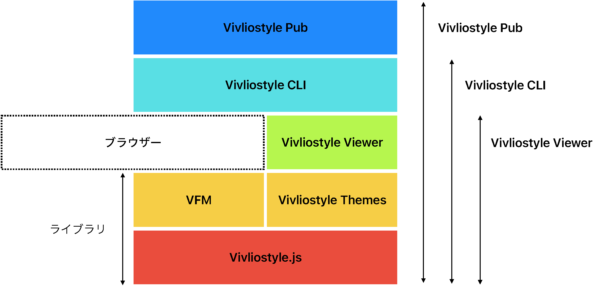

# Vivliostyleで旅行エッセイを 共同編集／オンデマンド印刷{.cover}

## 小形克宏

### 2023年5月28日 Vivliostyle ユーザーと開発者の集い2023春

# 本日お伝えしたいこと{#agenda}

- フォトアルバムをCSS組版で本にしました
- そのリポジトリを公開しています
- 注目してほしいのはスタイルシート
- OSによってページがずれる課題も明らかに

# 元は海外旅行のフォトアルバム

{width=60%}

# CSS組版したPDFを印刷

{width=35%}

# 仕様

- 書名：海外旅行記 上巻（全3巻）
- 判型：A5判
- 製本：並製
- 頁数：284
- 印刷：欧文印刷㈱（オンデマンド印刷）
    - 参照→[Vivliostyle Pubで作成したPDFファイルを印刷するサービスが開始](https://vivliostyle.org/ja/blog/2022/09/07/service-to-print-pdfs/)（なお、PDF出力はVivliostyle CLI）
- 内容：村上代表のご両親のフォトアルバムをデジタル化したもの

# 作業分担とそれぞれの居住地

- CSS作成：村上代表（さいたま市）
- 編集制作：小形（横須賀市）
- 校正：@まや（村上姉、山形市）
- 著者：（仙台市）
    - →クラウド（GitHub／Slack／Dropboxなど）による共同編集が必須

# 制作の経緯

- 2020-10-30：最初のcommit
- 2021-04-10 ：イベントにて小形が[「Create Bookを使った旅行エッセイ本の制作」](https://docs.google.com/presentation/d/1YB46WOHMR7TWjqjgnnigBlYXCM8cDost84H9kNW1Jtc/edit#slide=id.p)として途中経過を報告
- 2022-04-13：欧文印刷からの申し出によりテスト印刷
- 2022-10-：@まやが参加し作業が加速
- 2023-02-24：校了、欧文印刷入稿
- 2023-03-16：完成
- 2023-05-23：リポジトリを[kaigainotabi1](https://github.com/MurakamiShinyu/kaigainotabi1)として公開

# 制作フロー（表紙以外）

1. カラー写真をスキャン
2. Wordファイルからテキスト変換
3. スタイルシートを設計
4. テキストデータをMarkdownに変換
5. プレビューを見ながら写真を配置
6. PDFを出力し著者へ（校正出し）
7. データに著者校を反映（4校まで繰り返す）
8. PDFを出力し印刷所へ入稿

# theme.cssの変遷①

- 2020年秋以降のVivliostyle開発履歴そのもの
    - 2020-10-31版（82行）と2023-5-25版（460行）のDiff画面→
    - GitHub DesktopのHistory画面→
- 2020-10-31
    - [CSS Paged Media Module Level 3](https://www.w3.org/TR/css-page-3/)によるページ分割
    - [CSS Generated Content for Paged Media](https://drafts.csswg.org/css-gcpm-4/)による柱
    - [CSS Page Floatsによる画像配置](https://www.w3.org/TR/css-page-floats-3/)

# theme.cssの変遷②

- 2020-11-05
    - 画像がページに1つ入るクラスの新設
    - 画像がページに2つ入るクラスの新設
- 2020-11-13
    -太ゴシックのクラスを新設
- 2020-12-09
    - Sassに対応
- 2020-12-24
    - 節と項にもIDを付加するように

# theme.cssの変遷③

- 2020-12-25
    - 行頭をインデントしないクラス
    - ページ直後が偶数の場合、白ページを挿入する（改丁）クラス
- 2020-12-26
    - ページの直前で改ページ、直後で改ページするクラス
    - 画像がbottomにフロートするクラス
    - 画像がtopにフロート、bottomにフロートするクラス
- 2020-12-29
    - YakuCaltフォントによる重複約物の詰め処理を追加
    - Named stringsで柱を表示するように変更

# theme.cssの変遷④

- 2021-03-13
    - ページフォーマットの単位をミリからpxに変更
- 2021-03-13
    - 見出しに字間詰め `font-feature-settings: "palt"`を指定
- 2021-03-30
    - 直前で改ページし、1つのphotoをtopに配置し、直後に改ページするクラスを修正
- 2021-07-20
    - 文字間をわずかに詰めるクラス、開けるクラスを新設

# theme.cssの変遷⑤

- 2021-12-09
    - 和欧間スペースと重複約物の詰め処理に対応
        - Text Module Level 4 `text-spacing`
    - YakuCaltフォントの指定を削除
    - 句読点のぶら下げに対応
        - CSS Text Module Level 3に対応`hanging-punctuation`
- 2020-01-14
    - ページに画像2つを横に配置するクラスを新設
- 2022-04-07
    - テスト印刷用にWebフォントを適用
- 2022-06-14
    - Webフォント適用前に戻す

# theme.cssの変遷⑥

- 2022-07-24
    - Sass使用を廃止してCSS変数に移行
- 2022-09-26
    - ページの天地左右中央に画像を配置するクラスを新設（地図用）
- 2022-11-21
    - Vivliostyle Pub用に本文フォントをNoto Serif CJKに変更
- 2022-12-16
    - nthページを使って、特定のページにノンブルを入れないクラスを新設
- 2023-02-08
    - 奥付用のクラスを新設

# 浮上した課題

- 組版エンジン（Vivliostyle.js）とフォントは同じなのに、OSが異なると組版結果が違ってしまう
    -  [Same fonts, but different output by OS #1098 (Vivliostyle.js)](https://github.com/vivliostyle/vivliostyle.js/issues/1098)

# issue #1098の影響

- Vivliostyleのプロダクトは層状に構成されている
   - →Vivliostyle.jsのバグは、全プロダクトに影響

{width=65%}

